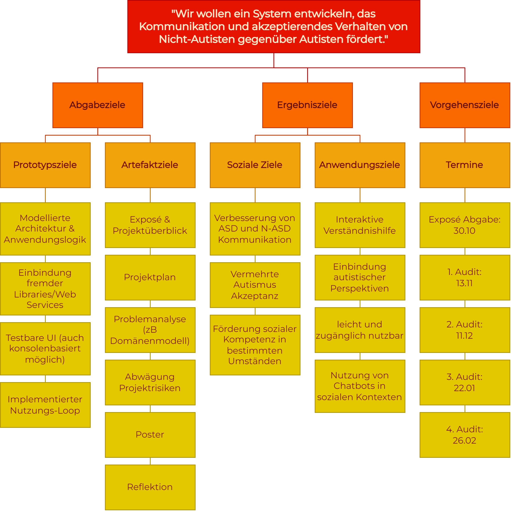

# Zielhierachie

Die Ziehierachie dient dazu, Projektziele auf übersichtliche Weise zu gliedern. Hierbei werden der übergeordneten Zielsetzung weitere Unterzielgruppen zugeordnet: Abgabeziele, Ergebnisziele und Vorgehensziele. Diese werden auf der hierarchisch unterliegenden Ebene weiter unterteilt, und anschließend in konkrete Ziele gegliedert. 

Abgabeziele befassen sich mit EP-relevanten Zielen, wie dem Poster oder dem Exposé. Die Ergebnisziele fokusieren sich auf die zu erarbeitende Problemraumlösung. Hier wurden die Anwendungsziele im Rahmen des frühen Entwicklungsstandes noch sehr offen gehalten.

