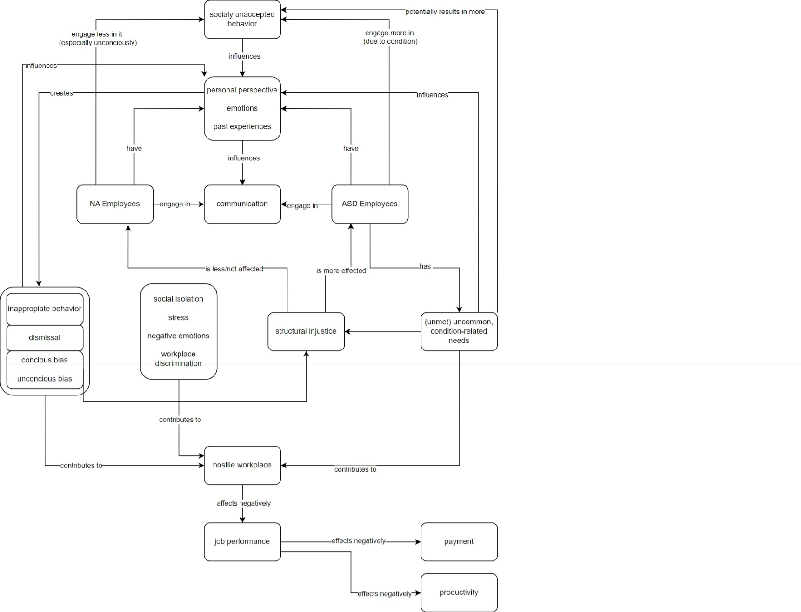

# Exposé

## Problemraumanalyse

*Schwierigkeiten in der sozialen Interaktionen zwischen Individuen mit und ohne Austimus-Spektrum-Störung*

Menschen mit Autismus-Spektrum-Störung (ASD) sind vor bestimmte Herausforderungen gestellt. Herausforderungen entstehen oft bei sozialer Kommunikation und Interaktion sowie eingeschränkten oder wiederholenden Verhaltensweisen oder Interessen. Diese Beeinträchtigungen sind mit kleineren sozialen Netzwerken, weniger Freundschaften, Schwierigkeiten bei der Arbeitssuche und -erhaltung, hoher Einsamkeit und insgesamt einer verringerten Lebensqualität verbunden. 

Forscher haben intensiv die kognitiven und neurologischen Unterschiede untersucht, die zu Schwierigkeiten in der sozialen Interaktion bei ASD führen. Dabei wurde festgestellt, dass nicht nur die soziale Fähigkeit, sondern auch die Art und Weise der sozialen Ausdrucksweise eine Rolle spielt. Bei ASD sind viele Aspekte der sozialen Präsentation ungewöhnlich, wie etwa untypische Gesichtsausdrücke, eigenartiger Blickkontakt, seltene oder ungewöhnliche Gesten, eine andere Auffassung von persönlichem Raum und eine besondere Stimmgebung. Diese Unterschiede können die Qualität der sozialen Interaktion beeinflussen. Personen, die ASD beobachten und nicht vertraut sind, neigen dazu, die Ausdrücke dieser Personen als ungeschickt oder seltsam zu bewerten. Dies kann die Interaktion beeinflussen und möglicherweise die Absicht zur Initiierung sozialer Interaktion verringern.

Erwachsene mit Autismus erfahren Vorurteile von Nicht-Autisten und werden oft sozial ausgeschlossen. Das erschwert es ihnen, Freundschaften zu schließen und Arbeit zu finden. Während einige Programme Autisten anleiten, sich anzupassen, gibt es weniger, die Nicht-Autisten beibringen, autismusfreundlicher zu sein. In einer Studie wurde ein kurzes Video mit Unterstützung von Autisten erstellt, um Menschen über Autismus aufzuklären. Es zeigte sich, dass Nicht-Autisten, die dieses Video sahen, bessere Kenntnisse und freundlichere Einstellungen gegenüber Autismus hatten.

### Ursache-Wirkung-Diagramm

## Zielsetzung

Wir wollen ein System entwickeln, das Kommunikation und akzeptierendes Verhalten von Nicht-Autisten gegenüber Autisten in der Arbeitswelt fördert. Zu akzeptierendem Verhalten gehört hierbei auch eine Aufmerksamkeit auf mit ASD einhergehenden Herausforderungen und Sensibilitäten und mögliche entsprechende Gesatltung des Arbeitsraumes.

## Kontextabgrenzung

In der ersten Phase der Entwicklung, wurde der Problemraum im Allgemeinen untersucht. Dies erlaubt ein weitgehendes Verständnis der Problemlage; um aber ein konkretes und effektives Lösungssystem entwickeln zu können, muss dieser Problemraum adequat eingegrenzt werden. Verschiedene Bereiche kamen hierbei infrage, unter anderem der Kontext von Kindern mit ASD in ihren Familien, Kindern von ASD in schulischem Kontext und Menschen mit ASD im öffentlich-rechtlichen Kontext. Nach Analyse der Notwendigkeit und Umsetzbarkeit eines Lösungssystems in den verschiedenen Bereichen wurde eine Festlegung des Lösungskontextes auf Menschen mit ASD im Arbeitsleben vorgenommen. Im weiteren Verlauf wird dieser Bereich noch einmal detailierter analysiert und ein Lösungssystem auf Basis der gefundenen Probleme und Gegebenheiten erstellt.

Das Domänenmodell befasst sich besonders mit den direkten Verhältnissen zwischen Autisten und ihren Arbeitskollegen, sowie wie diese ihr Arbeitserlebnis beeinflussen.

Aufgrund ihrer Spektrumsstörung haben Menschen mit ASD neben möglichen Schwächen oder Problemen auch Stärken, welche ihnen und ihren Kolleg:innen und Arbeitgebern im zugute kommen können, wie beispielweise strukurierte Arbeitsweisen. Für ein besseres Verständnis und insgesamt positiveres Miteinander ist es also ratsam nicht nur die Schwierigkeiten von Menschen mit ASD und Möglichkeiten mit diesen umzugehen zu beleuchten, sondern auch die möglichen Stärken hervorzuheben. Das Lösungssystem strebt eine allgemeine Beleuchtung der Thematik ASD an, sowie eine konkrete Fokusierung auf Möglichkeiten und Notwendigkeiten von Menschen mit ASD im Arbeitsleben. Hierzu gehören auch rechtliche Pflichten aber auch Forderungen von Seiten des Arbeitgebers. 

Die ursprüngliche allgemeine Problemraumanalyse ist hier zu finden:

- [Erstes Domänenmodell](Artefacts/Original_Domaenenmodell.md)
- [Originale Stakeholderanalyse](Artefacts/Original_Stakeholder.md)
- [Originale Erfordernisse](Artefacts/Original_Erfordernisse.md)

## Leitfragen

- Können Interaktive Übungen negative Eindrücke und Vorurteile von Nicht-Autisten gegenüber Autisten verringern?
- Wie kann ein interaktives Toleranztraining im Bereich Autismus gamifiziert gestaltet werden?

## Themen 

- Toleranztraining im Bereich Arbeitswelt
- Autismus am Arbeitsplatz
- Gamification
- Interaktive Schulungen

## Alleinstellungsmerkmal

- Kommunikationstraining im Bereich ASD beinahe vollständig zum Training von Menschen mit ASD
- Dieses System für das Training von Menschen ohne ASD für eine verbesserte Interaktion mit Menschen mit ASD

## Nutzungsmotivation

- Schulungsangebote für Unternehmen
- Toleranztraining für Customer Service Reps (Umgang mit AAC Devices, Eingang auf untypische Körpersprache, etcetera)
- Weiterbilungsmöglichkeiten für Kollegen und Manager
- Interesse für eigene Weiterentwicklung -- Ausbau der eigenen Empathie und Rückbildung von Stereotypen
- Effektivere Einbindung von autistischen Mitarbeitern

## Erwartete Ergebnisse

- zugängliches Tool, welches mittels Unterstützung von Language Learning Modells Toleranz und Aufklärungstraining für Nicht-Autisten gegenüber Autisten bietet
- Förderung des Verständniss der Nutzergruppe gegenüber Menschen die aufgrund von ASD als "anders" betrachtet werden
- Nutzung ermöglicht stärkere soziale Bindungen und motiviert Nicht-Autisten auf Autisten zuzugehen und auf diese einzugehen
- Verringerung unbewusster Vorurteile und Abneigungen gegen Autisten
- Förderung von alternativen Kommunikationswegen für die Kommunikation mit Autisten

## Weitere Artefakte

- [Forschungsstand](Artefacts/Quellen.md)
- [Erste Betrachtung der Projektrisiken](Artefacts/Projektrisiken.md)
- [Projektplan](Artefacts/Projektplan.md)
- [Stakeholderanalyse](Artefacts/Stakeholder.md)
- [Erfordernisse](Artefacts/Erfordernisse.md)
- [Zielhierachie](Artefacts/Zielhierachie.md)
- [Anforderungen](Artefacts/Anforderungen.md)

